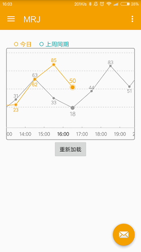
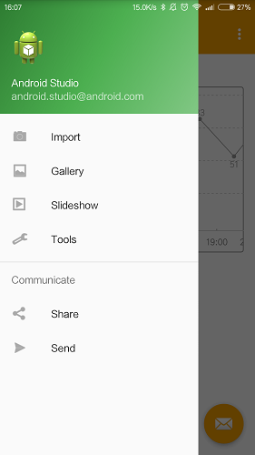

# StatusBarUtil
透明状态栏只有在 SDK >= 19 (Android 4.4) 才会生效.

    protected void onCreate(Bundle savedInstanceState) {
        super.onCreate(savedInstanceState);

        StatusBarCompat.setStatusBarColor(this, Color.parseColor("#F4A100"));
        StatusBarCompat.translucentStatusBar(this);
		/**
			布局的属性 android:fitsSystemWindows="false"
			setContentView之前调用,必须 false
			setContentView之后调用,必须 true
			SDK >= 21 需要机型测试达到完美兼容
		*/
        setContentView(R.layout.activity_main);
		.....
	}

##效果图

	
